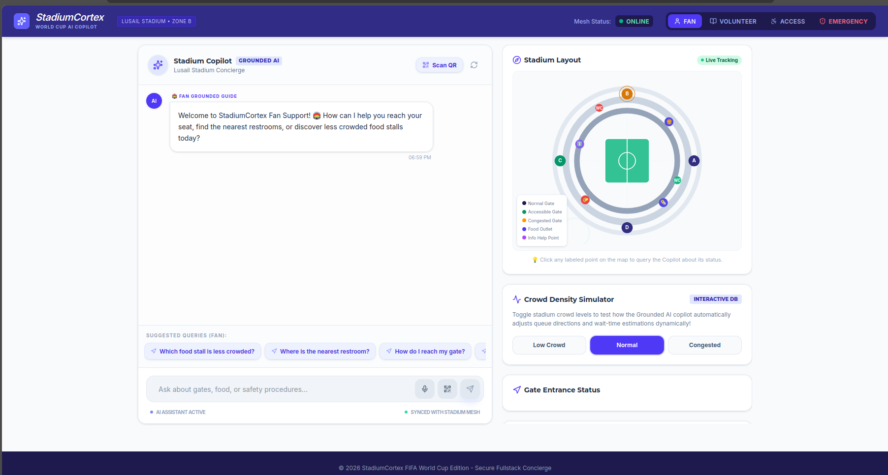
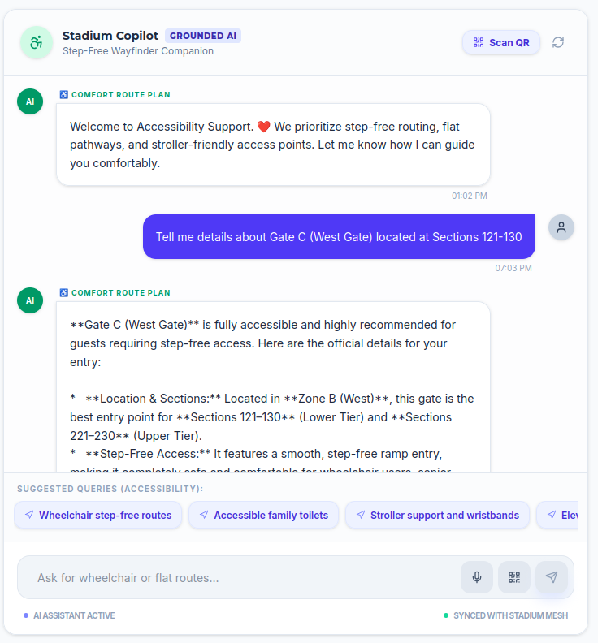
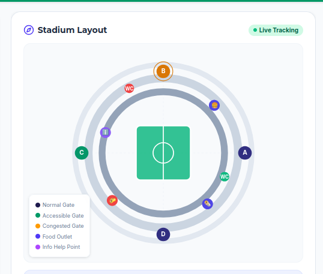

<div align="center">

# 🏟️ StadiumCortex

### AI-Powered Smart Stadium Copilot

**Enhancing fan experience, navigation, crowd management, and stadium operations using Generative AI.**


---

## 📸 Application Preview



</div>

---

# 🚀 About

**StadiumCortex** is an AI-powered stadium assistant built to enhance the overall tournament experience for **fans, volunteers, organizers, and stadium staff**.

Powered by **Google Gemini AI**, StadiumCortex delivers intelligent real-time assistance for navigation, stadium information, accessibility, transportation, crowd awareness, and emergency guidance through an interactive conversational interface.

The platform combines an intuitive dashboard, interactive stadium map, and AI-powered decision support to make large sporting events safer, smarter, and more enjoyable.

---

# ✨ Features

- 🤖 AI Stadium Copilot powered by Google Gemini
- 🗺 Interactive Stadium Layout
- 📍 Smart Gate Navigation
- 🚶 Crowd Density Simulation
- 🎟 Fan Assistance
- ♿ Accessibility Support
- 🌍 Multilingual Guidance
- 🚨 Emergency Information
- 📱 Fully Responsive Interface
- ⚡ Real-Time AI Responses

---

# 🖥️ User Interface

The dashboard provides:

- Interactive AI Chat Assistant
- Stadium Layout Visualization
- Live Crowd Density Simulation
- Gate Status Monitoring
- Suggested Fan Queries
- QR Code Scanner
- Real-Time Stadium Information

---

# 🏗️ System Architecture

```text
                      User
                        │
                        ▼
        React + TypeScript Frontend
                        │
                        ▼
          Google Gemini AI API
                        │
                        ▼
        Stadium Knowledge Base
                        │
                        ▼
             Intelligent Response
```

---

# 🛠️ Tech Stack

| Category | Technology |
|----------|------------|
| Frontend | React |
| Language | TypeScript |
| Build Tool | Vite |
| AI | Google Gemini API |
| Runtime | Node.js |
| Version Control | Git & GitHub |

---

# 📂 Project Structure

```
StadiumCortex/
│
├── src/
├── assets/
├── data/
├── screenshots/
├── index.html
├── package.json
├── package-lock.json
├── server.ts
├── vite.config.ts
├── tsconfig.json
├── metadata.json
├── .gitignore
├── .env.example
└── README.md
```

---

# ⚙️ Installation

### Clone the Repository

```bash
git clone https://github.com/jashwanth-gif/StadiumCortex.git
```

### Navigate to the Project

```bash
cd StadiumCortex
```

### Install Dependencies

```bash
npm install
```

### Configure Environment Variables

Create a `.env` file in the project root.

```env
GEMINI_API_KEY=YOUR_GEMINI_API_KEY
```

### Start Development Server

```bash
npm run dev
```

---

# 📸 Screenshots

## Home Dashboard


---

## AI Copilot



---

## Stadium Layout



---

## Crowd Density Simulator


---

# 🎯 Use Cases

- FIFA World Cup
- Cricket Stadiums
- Football Arenas
- Concert Venues
- Exhibition Centers
- Sports Complexes
- Public Events

---

# 🌟 Future Enhancements

- 🎤 Voice-Based AI Assistant
- 📡 Real-Time Crowd Analytics
- 🛰 Indoor Navigation
- 🍔 Smart Food Stall Recommendations
- 🎫 Ticket Verification
- 📷 QR Code Navigation
- 🚑 Emergency Evacuation Planner
- 📊 Live Crowd Prediction
- 🌐 Multi-Stadium Support

---

# 🔒 Security

Sensitive information such as API keys is securely stored using environment variables and is **never committed** to the repository.

---

# 🌐 Live Demo 
https://stadium-cortex.vercel.app/

---

# 👨‍💻 Developer

**Jashwanth Maheshuni**

Computer Science Student

AI • Data Science • Web Development

---

# 🤝 Contributing

Contributions, feature requests, and suggestions are always welcome.

Fork the repository and submit a Pull Request.

---

# 📜 License

This project is licensed under the **MIT License**.

---

# 🙏 Acknowledgements

- Google Gemini AI
- React
- Vite
- TypeScript
- Open Source Community

---

<div align="center">

## ⭐ If you like this project, please consider giving it a Star.

Made with ❤️ using React, TypeScript and Google Gemini AI.

</div>
